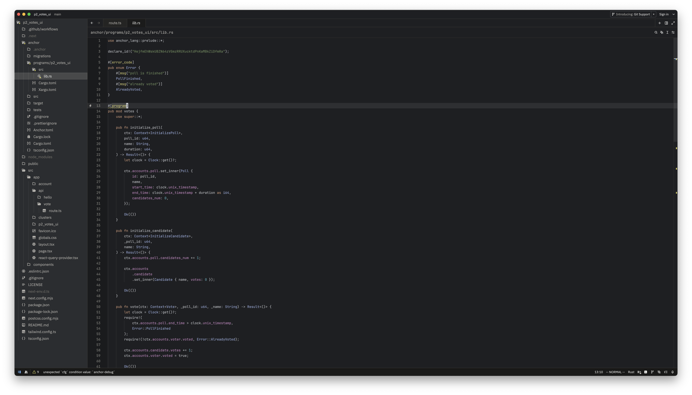

<h1 align="center">
  RustRover Theme for Zed
</h1>
<p align="center">
  A dark theme inspired by RustRover's default dark theme
</p>



---

## Installation

1. Download the following files:
   - `themes/rust-rover.json`
   - `package.json`
2. Copy them to Zed's themes folder:
   ```bash
   mkdir -p ~/.zed/themes
   cp themes/rust-rover.json ~/.zed/themes/
   cp package.json ~/.zed/themes/
3. Restart Zed and select the theme.

---

## License

This project is licensed under the terms of the [MIT License](./LICENSE.md).
